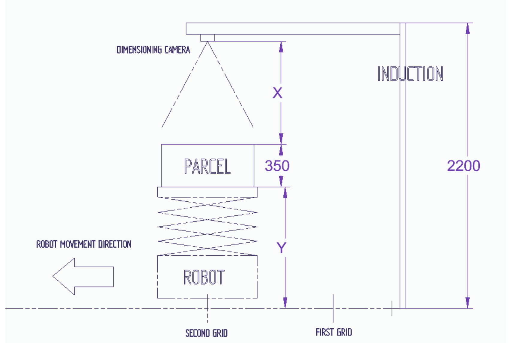

## Task Overview
Build a dimension measurement system that would capture the length, width and height for the parcel placed on the AGV. For each parcel calculate the box volume and true volume.

- Box Volume: A bounding box around the parcel calculate its volume.
- True Volume: Calculate the original volume of the parcel(Deformed or poly bags), For box parcels the box volume and true volume are same.

## Sample Parcel Image Dataset

A folder [link]() containing sample images of various parcel types will be shared along with this document. The dataset includes representative photos showing:

- Variation in parcel sizes
- Common shapes and surface textures
- Reflective or glossy packaging materials
- Color variations and potential overhangs or deformations
- Real-world placement on AGV top surfaces

## Data to be delivered per parcel:
1. Length (mm)
2. Width (mm)
3. Height (mm)
4. Timestamp in millisecond
5. Parcel type (Box, polybag, etc.)
6. Image with embossed measurements
7. Box Volume and True Volume.

## Preferred Output Format:
1. JSON or other structured format.
2. Image with volume data annotated on it.

## Evaluation Criteria

Accuracy and reliability of measurements.
1. Box parcels:
- Dimension accuracy: ±10 mm.
- Volume accuracy: ±50 mm³.

2. Deformable / polybags (True Volume):

- Relative accuracy: ±10mm .
- Volume accuracy: ±50 mm³.